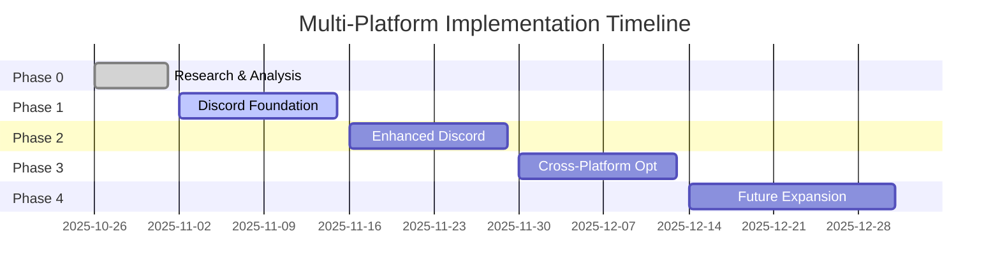

# Multi-Platform Messenger Support Implementation Roadmap

**Document Version**: 1.0
**Date**: November 1, 2025
**Scope**: Strategic plan for dcmaidbot cross-platform expansion

## Executive Summary

This roadmap outlines the strategic implementation of multi-platform support for dcmaidbot, beginning with Discord integration while maintaining and enhancing the existing Telegram functionality. The initiative will transform dcmaidbot from a Telegram-only bot into a cross-platform AI companion.

## Vision Statement

To create a unified AI companion that provides consistent, engaging interactions across multiple messaging platforms while leveraging each platform's unique capabilities for enhanced user experience.

## Strategic Goals

1. **Platform Expansion**: Enable dcmaidbot to operate seamlessly on Telegram and Discord
2. **Consistent Experience**: Maintain unified character personality and behavior across platforms
3. **Feature Parity**: Ensure core functionality is available on all supported platforms
4. **Platform Optimization**: Leverage unique features of each platform for enhanced engagement
5. **Scalable Architecture**: Build foundation for future platform additions

## Implementation Phases

### Phase 0: Foundation (Completed - PRP-018 Research)
**Status**: ✅ Complete
**Duration**: 1 week

**Completed Activities**:
- ✅ Deep analysis of Telegram and Discord capabilities
- ✅ Unified abstraction layer architecture design
- ✅ Feature comparison matrix created
- ✅ Discord integration requirements defined
- ✅ Technical feasibility confirmed

**Deliverables**:
- Comprehensive research report (`PRP-018_RESEARCH_REPORT.md`)
- Discord integration PRP (`PRPs/PRP-019.md`)
- Unified abstraction layer design specifications

### Phase 1: Discord Foundation (PRP-019)
**Status**: 📋 Planned
**Duration**: 2 weeks
**Priority**: High

**Objectives**:
- Implement Discord bot service with unified abstraction
- Enable basic Discord functionality with feature parity
- Establish cross-platform content conversion

**Key Activities**:
1. **Discord Service Implementation** (Days 1-2)
   - Create `DiscordService` class extending `MessengerService`
   - Implement Discord bot authentication and connection
   - Add Discord-specific configuration management

2. **Content Conversion System** (Days 3-4)
   - Build unified content to Discord embed conversion
   - Implement markdown formatting for Discord
   - Create media attachment handling system

3. **Slash Commands Integration** (Days 5-6)
   - Register Discord slash commands
   - Map existing bot commands to Discord format
   - Implement command validation and error handling

4. **Interactive Components** (Days 7-8)
   - Add Discord buttons with proper styling
   - Implement select menus and modal forms
   - Create component interaction handlers

5. **Cross-Platform Integration** (Days 9-10)
   - Integrate with memory and character systems
   - Implement unified user identification
   - Performance optimization and testing

**Success Criteria**:
- Discord bot responds to all basic commands
- Content conversion works correctly between platforms
- Character personality is consistent across platforms
- All E2E tests pass

### Phase 2: Enhanced Discord Features (PRP-020)
**Status**: 📋 Planned
**Duration**: 2 weeks
**Priority**: Medium

**Objectives**:
- Implement Discord-specific advanced features
- Optimize user experience for Discord platform
- Add Discord-native interaction patterns

**Key Activities**:
1. **Discord Embeds Enhancement**
   - Advanced embed formatting
   - Rich media galleries
   - Interactive embed elements

2. **Thread System Integration**
   - Automatic thread creation for conversations
   - Thread management commands
   - Cross-platform conversation continuity

3. **Reaction System**
   - Emoji reaction handling
   - Reaction-based interactions
   - Sentiment analysis integration

4. **Voice Channel Features**
   - Basic voice channel integration
   - Voice activity monitoring
   - Audio content sharing

### Phase 3: Cross-Platform Optimization (PRP-021)
**Status**: 📋 Planned
**Duration**: 2 weeks
**Priority**: Medium

**Objectives**:
- Optimize cross-platform performance
- Implement advanced synchronization features
- Enhance multi-platform user experience

**Key Activities**:
1. **Performance Optimization**
   - Content conversion caching
   - Cross-platform state synchronization
   - Connection pooling optimization

2. **Advanced Synchronization**
   - Real-time preference synchronization
   - Cross-platform conversation history
   - Unified notification system

3. **Analytics and Monitoring**
   - Cross-platform usage analytics
   - Performance monitoring dashboard
   - User behavior analysis

### Phase 4: Future Platform Expansion (PRP-022)
**Status**: 📋 Planned
**Duration**: 3 weeks
**Priority**: Low

**Objectives**:
- Design framework for additional platform support
- Implement framework for rapid platform onboarding
- Evaluate additional platforms (Slack, WhatsApp, etc.)

**Key Activities**:
1. **Platform Framework Design**
   - Abstract platform interface design
   - Plugin architecture for platforms
   - Configuration-driven platform setup

2. **Platform Evaluation**
   - Technical feasibility analysis
   - User base assessment
   - Integration complexity evaluation

3. **Prototype Implementation**
   - Select next target platform
   - Implement prototype integration
   - Validate framework effectiveness

## Technical Architecture Overview

### Unified Abstraction Layer
```
┌─────────────────────────────────────────────────────────┐
│                 Application Layer                       │
├─────────────────────────────────────────────────────────┤
│              Unified Messenger Interface                │
├─────────────────────────────────────────────────────────┤
│  Platform Adapters  │  Telegram  │    Discord    │  ... │
├─────────────────────────────────────────────────────────┤
│           Core Services (LLM, Memory, Character)       │
└─────────────────────────────────────────────────────────┘
```

### Content Flow
```
User Request → Platform Adapter → Unified Interface → Core Services →
Content Generation → Platform Adapter → Platform-Specific Response
```

## Risk Management

### High-Risk Items

1. **Platform API Changes**
   - **Risk**: API updates breaking integration
   - **Mitigation**: Version-specific adapters, automated testing
   - **Monitoring**: API change notifications, compatibility tests

2. **Performance Degradation**
   - **Risk**: Cross-platform overhead affecting response times
   - **Mitigation**: Efficient conversion algorithms, caching
   - **Monitoring**: Performance metrics, response time tracking

3. **User Experience Fragmentation**
   - **Risk**: Inconsistent experience across platforms
   - **Mitigation**: Unified interaction patterns, platform optimization
   - **Monitoring**: User feedback, cross-platform analytics

### Medium-Risk Items

1. **Maintenance Complexity**
   - **Risk**: Increased maintenance burden with multiple platforms
   - **Mitigation**: Shared components, automated testing
   - **Monitoring**: Code quality metrics, test coverage

2. **Security Considerations**
   - **Risk**: Additional attack surface with multiple platforms
   - **Mitigation**: Centralized security policies, token management
   - **Monitoring**: Security audits, vulnerability scanning

## Resource Requirements

### Development Resources
- **Backend Developer**: 1 FTE for 2 months
- **QA Engineer**: 0.5 FTE for 1.5 months
- **DevOps Engineer**: 0.25 FTE for 1 month

### Infrastructure Resources
- **Discord Bot Hosting**: No additional cost (uses existing infrastructure)
- **Monitoring**: Enhanced logging and metrics (minimal cost increase)
- **Testing**: Additional test environments (temporary increase)

### External Dependencies
- **Discord Developer Account**: Free tier sufficient
- **Discord.py Library**: Open source, actively maintained
- **Additional Libraries**: Minimal cost impact

## Success Metrics

### Technical Metrics
- **Response Time**: < 2 seconds across all platforms
- **Uptime**: > 99% for all platform services
- **Content Conversion Accuracy**: > 95%
- **Test Coverage**: > 90% for cross-platform code

### Business Metrics
- **User Growth**: 50% increase in total active users
- **Engagement**: 30% increase in daily interactions
- **Retention**: 70% cross-platform user retention
- **Satisfaction**: 4.5/5 average user rating

### Platform-Specific Metrics
- **Discord Adoption**: 100 Discord server members within 3 months
- **Cross-Platform Usage**: 40% of users engage on multiple platforms
- **Feature Utilization**: 60% adoption of platform-specific features

## Timeline Overview



## Dependencies and Prerequisites

### Technical Dependencies
- ✅ Unified messenger service abstraction (PRP-016)
- ✅ Telegram Bot API integration (existing)
- ✅ Core services (LLM, Memory, Character)
- ⏳ Discord bot application and token
- ⏳ Enhanced configuration management

### Business Dependencies
- ✅ Stakeholder approval for Discord integration
- ⏳ Discord server setup and configuration
- ⏳ Community management strategy
- ⏳ Cross-platform user communication plan

## Monitoring and Evaluation

### Key Performance Indicators (KPIs)

1. **Technical Performance**
   - API response times per platform
   - Error rates and failure patterns
   - Resource utilization metrics
   - Conversion processing times

2. **User Engagement**
   - Daily active users per platform
   - Command usage patterns
   - Session duration metrics
   - Cross-platform user behavior

3. **Business Impact**
   - Total user growth rate
   - Community engagement metrics
   - Feature adoption rates
   - User satisfaction scores

### Review Schedule
- **Weekly**: Technical progress review
- **Bi-weekly**: KPI performance review
- **Monthly**: Strategic milestone assessment
- **Quarterly**: Overall roadmap evaluation

## Conclusion

This multi-platform expansion represents a significant evolution for dcmaidbot, transforming it from a single-platform bot into a comprehensive cross-platform AI companion. The phased approach ensures manageable implementation while maintaining the quality and character consistency that users expect.

The unified abstraction layer designed in PRP-018 provides a solid foundation for this expansion, while the detailed implementation plan in PRP-019 ensures successful Discord integration. Future phases will continue to enhance the multi-platform experience and prepare for additional platform support.

**Key Success Factors**:
1. Maintaining consistent character personality across platforms
2. Leveraging platform-specific features for enhanced engagement
3. Ensuring high performance and reliability
4. Building scalable architecture for future expansion

This roadmap positions dcmaidbot for significant growth and enhanced user engagement through strategic multi-platform expansion.

---

**Document Status**: Final
**Next Review**: November 15, 2025 (after PRP-019 Phase 1 completion)
**Owner**: Development Team
**Approved By**: Project Stakeholders
